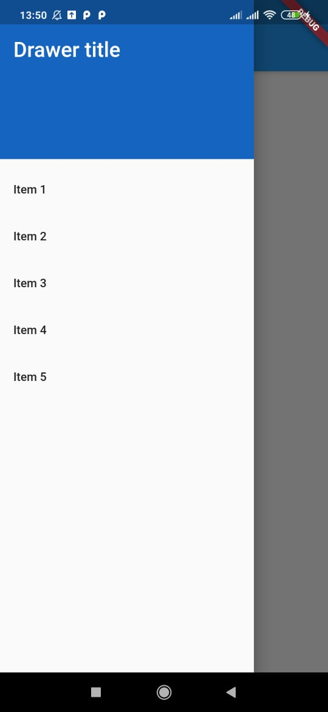

# drawerflutter

In apps that use Material Design, there are two primary options for navigation: tabs and drawers. When there is insufficient space to support tabs, drawers provide a handy alternative.

In Flutter, use the Drawer widget in combination with a Scaffold to create a layout with a Material Design drawer. This recipe uses the following steps:

1.Create a Scaffold.
2.Add a drawer.
3.Populate the drawer with items.
4.Close the drawer programmatically.

A few resources to get you started if this is your first Flutter project:
- [Cookbook: Useful Flutter samples](https://flutter.dev/docs/cookbook)
- [Drawer](https://flutter.dev/docs/cookbook/design/drawer)

For help getting started with Flutter, view our
[online documentation](https://flutter.dev/docs), which offers tutorials,
samples, guidance on mobile development, and a full API reference.

